# 🌐 PortSwigger Lab: User role controlled by request parameter

**Categoría:** 🚪 Access Control (Control de Acceso)  
**Dificultad:** 🟢 Apprentice (Fácil)  
**URL del Lab:** `https://portswigger.net/web-security/access-control/lab-user-role-controlled-by-request-parameter`  
**Vulnerabilidad:** Broken Access Control / Insecure Cookie-based Role Assignment (Vertical Privilege Escalation)  
**Credenciales proporcionadas:** `wiener:peter`  

---

## 📝 Lab Description & Objective

> **Descripción:**  
> Este laboratorio contiene una vulnerabilidad de control de acceso en su panel de administración. La aplicación determina si un usuario tiene privilegios de administrador basándose en una cookie modificable enviada en las solicitudes HTTP.
> 
> **Objetivo:**  
> Iniciar sesión con la cuenta de usuario estándar proporcionada (`wiener:peter`), acceder al panel de administración ubicado en `/admin` modificando la cookie de rol, y utilizar la funcionalidad de administrador para **eliminar al usuario `carlos`**.

---

## 🛠 Tools Used

- **Herramienta principal:** Burp Suite (Community / Professional)
- **Módulos utilizados:**
  - **Burp Proxy / Intercept & HTTP History:** Para capturar e inspeccionar las peticiones y respuestas HTTP.
  - **Burp Repeater:** Para modificar y reenviar solicitudes HTTP de forma controlada.

---

## 🔍 Phase 1: Recon & Analysis

### 1.1 Acceso al Laboratorio e Inicio de Sesión

1. Abrimos Burp Suite, nos dirigimos a la pestaña **Proxy** -> **Intercept** y hacemos clic en el botón **Open browser** para lanzar el navegador embebido preconfigurado con el proxy:

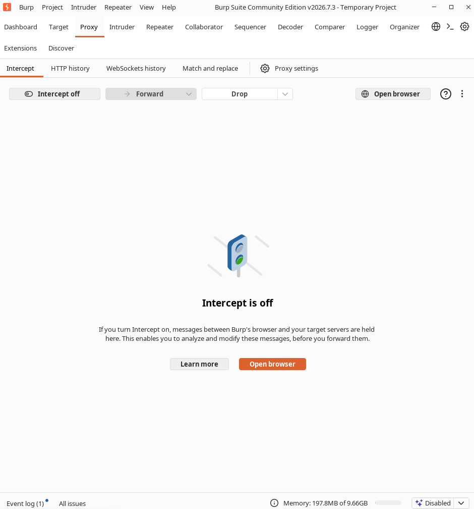

2. En el navegador que se abre, pegamos el enlace del ejercicio (`https://portswigger.net/web-security/access-control/lab-user-role-controlled-by-request-parameter`):

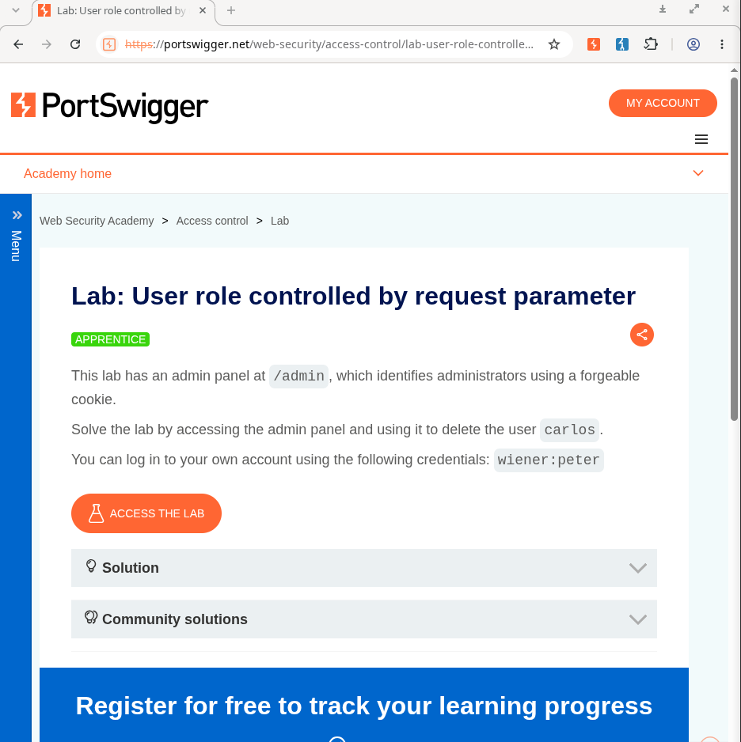

3. Hacemos clic en el botón **Access the lab** para iniciar y acceder a la instancia del laboratorio:

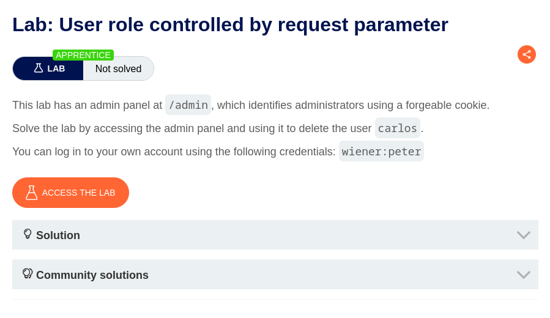

4. Una vez dentro de la tienda / aplicación web del laboratorio, nos dirigimos al apartado **My account** en la barra superior de navegación:

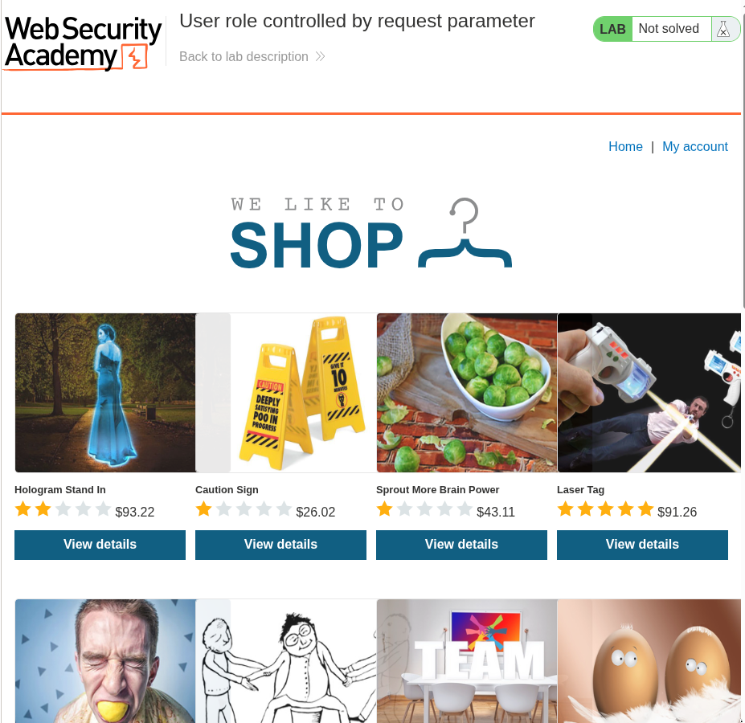

5. En el formulario de inicio de sesión (`/login`), ingresamos las credenciales de prueba proporcionadas:
   - **Username:** `wiener`
   - **Password:** `peter`

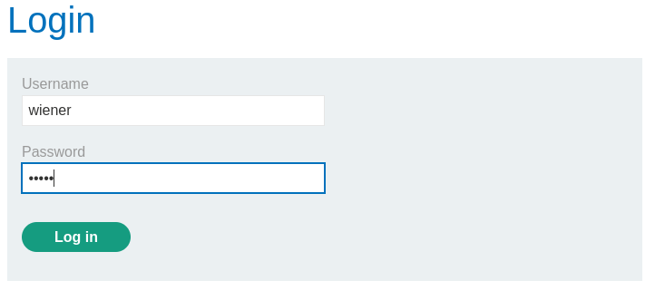

6. Antes de enviar las credenciales, nos aseguramos de tener activada la interceptación en Burp Suite (**Proxy -> Intercept is on**):

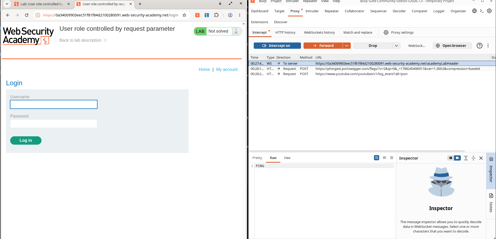

7. Al presionar el botón **Log in**, la petición `POST /login` queda retenida en Burp Suite, permitiéndonos inspeccionar los parámetros enviados (`csrf`, `username=wiener`, `password=peter`):

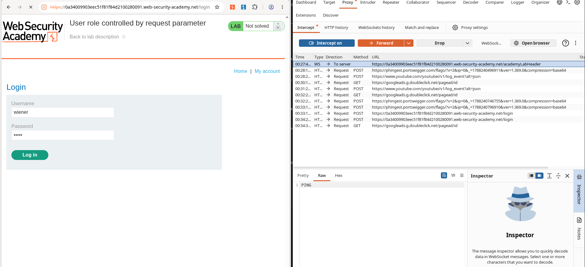

8. Hacemos clic en **Forward** para enviar al servidor las solicitudes que se encolaron en el proxy:

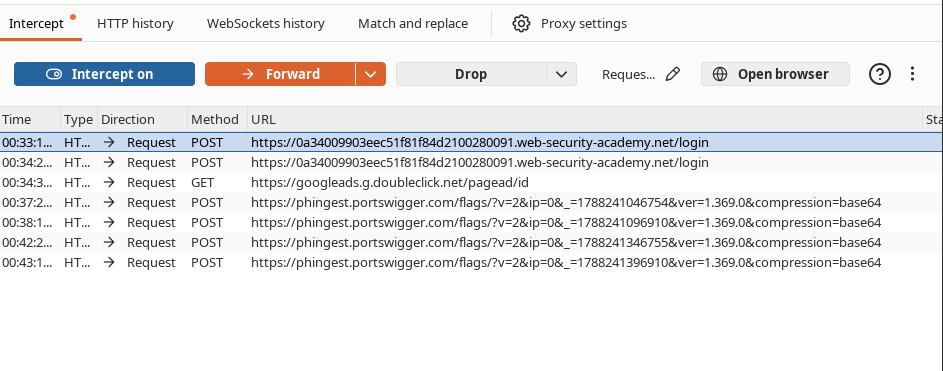

9. Tras completarse la autenticación, somos redirigidos a la vista de perfil en `/my-account`, donde se solicita o permite ingresar un correo electrónico de ejemplo:

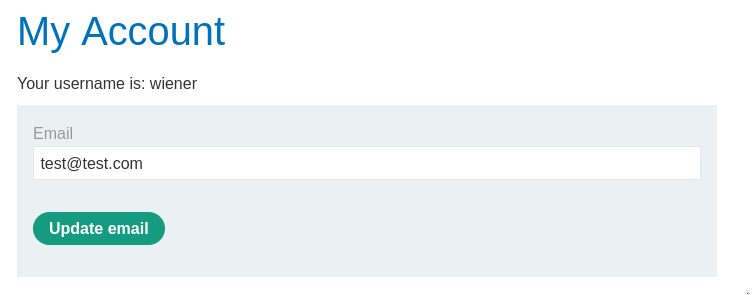

### 1.2 Inspección de Tráfico en Burp Suite

1. Al procesar el inicio de sesión y redirigirnos hacia `/my-account?id=wiener`, inspeccionamos la petición en Burp Suite (**Proxy -> Intercept** o **HTTP history**).
2. En la vista **Pretty** de los encabezados HTTP, observamos que se nos asigna y envía una cookie llamada `Admin` con el valor `false`:

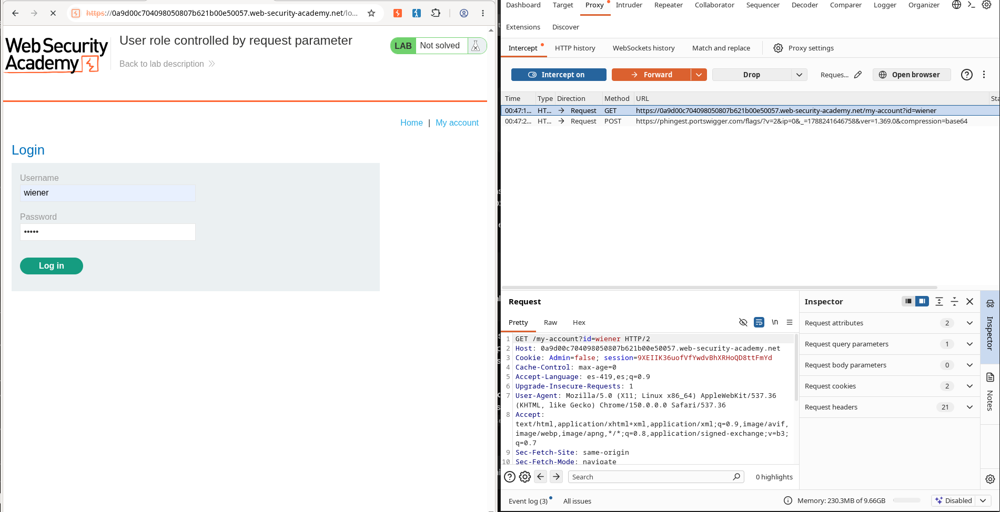

```http
GET /my-account?id=wiener HTTP/1.1
Host: target.web-security-academy.net
Cookie: Admin=false; session=xyz123...
```

> 🚨 **Vulnerabilidad Identificada:**  
> El rol del usuario no se valida en el backend mediante la sesión del servidor, sino que se confía ciegamente en el valor de la cookie del lado del cliente (`Admin=false`), lo que abre la puerta a una escalada de privilegios vertical mediante manipulación de cookies.

---

## 🚀 Phase 2: Exploitation & Resolution

### 2.1 Escalada de Privilegios a Administrador

1. Modificamos el valor de la cookie en la petición interceptada cambiando `Admin=false` por `Admin=true` y presionamos **Forward**:

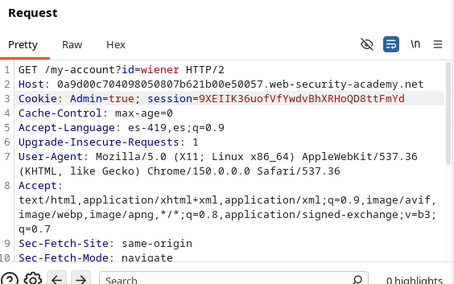

```http
GET /my-account?id=wiener HTTP/1.1
Host: target.web-security-academy.net
Cookie: Admin=true; session=xyz123...
```

2. Al procesarse la solicitud con la cookie modificada, en la interfaz web del navegador aparece habilitada la opción **Admin panel** en la barra superior, confirmando que la aplicación nos reconoce como administradores:

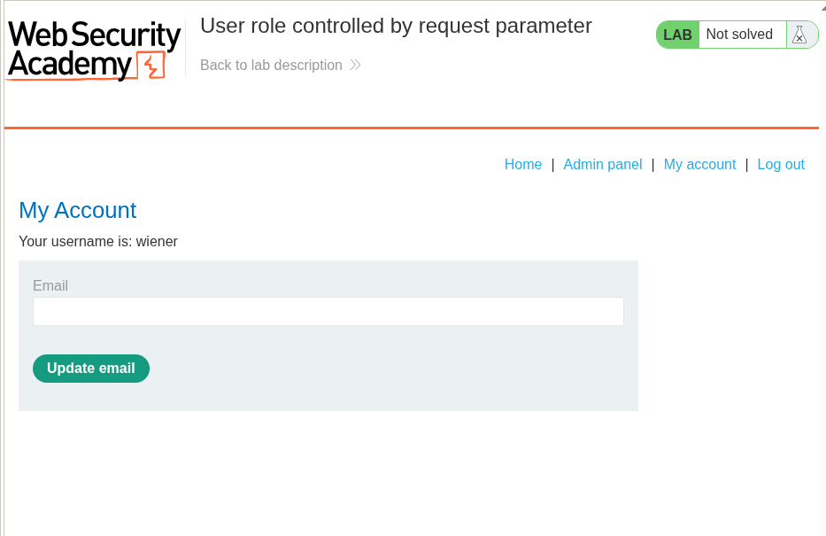

3. Hacemos clic en **Admin panel**. En la petición interceptada hacia `/admin`, verificamos y mantenemos la cookie `Admin=true`, luego presionamos **Forward**:

```http
GET /admin HTTP/1.1
Host: target.web-security-academy.net
Cookie: Admin=true; session=xyz123...
```

4. Esto nos carga la vista de administración con el listado de usuarios (**Users**), donde podemos visualizar las opciones de gestión y el enlace de eliminación para el usuario `carlos`:

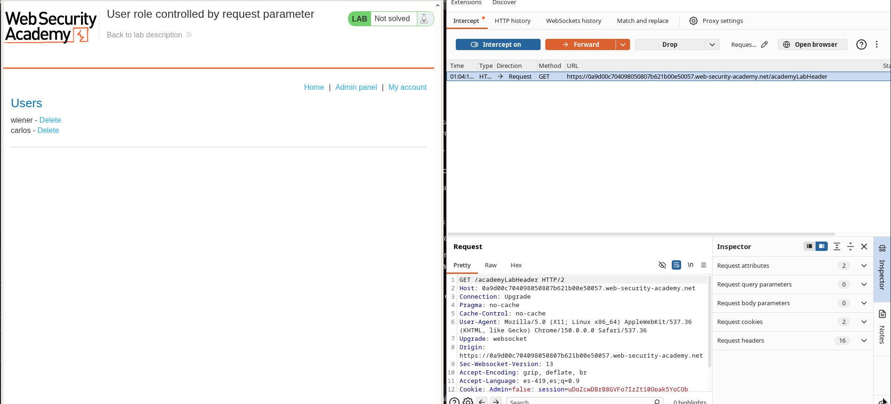

---

### 2.2 Eliminación del Usuario `carlos`

1. En la interfaz del panel de usuarios, hacemos clic en el botón **Delete** correspondiente a `carlos` (enviando la petición `GET /admin/delete?username=carlos` asegurando que la cookie viaje con `Admin=true`):

```http
GET /admin/delete?username=carlos HTTP/1.1
Host: target.web-security-academy.net
Cookie: Admin=true; session=xyz123...
```

2. Presionamos **Forward** para que el servidor procese la petición de borrado.
3. En las solicitudes subsiguientes interceptadas en Burp Suite, verificamos el estado de las cookies y enviamos con **Forward** cada una de las peticiones encoladas hasta completar la recarga del navegador.

---

## 🏁 Resolution Proof & Status

- **Resultado:** ✅ **Solved**
- **Acción completada:** El usuario `carlos` fue eliminado satisfactoriamente tras eludir las restricciones de acceso manipulando la cookie de rol en la petición. En la parte superior de la aplicación se confirma la resolución del laboratorio (**"Congratulations, you solved the lab!"**).

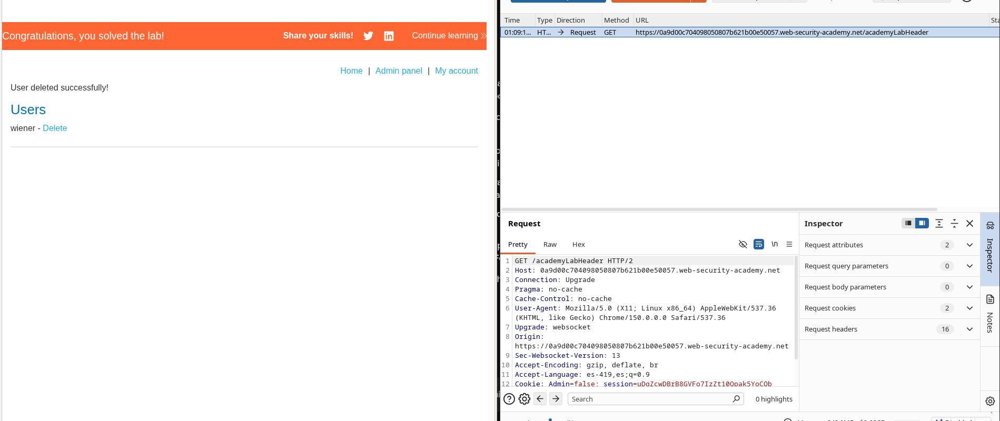

---

## 🛡️ Mitigation & Remediation

Para prevenir vulnerabilidades de control de acceso roto (Broken Access Control - CWE-284 / CWE-285):

1. **Nunca confiar en datos controlados por el cliente para la autorización:** Los roles y privilegios de usuario (`isAdmin`, `role`, `Admin`) deben almacenarse y validarse de forma estricta en la sesión del lado del servidor (o en un JWT firmado e inviolable).
2. **Validar permisos en cada endpoint administrativo:** Asegurar que cada controlador o ruta crítica verifique la sesión activa y los permisos correspondientes antes de ejecutar cualquier acción destructiva (`/admin/delete`).
3. **Principios de diseño seguro:** Implementar control de acceso basado en roles (**RBAC**) siguiendo el principio de mínimo privilegio y denegación por defecto (*deny by default*).

---

## 💡 Key Takeaways & Lessons Learned

- **Parámetros y Cookies manipulables:** Siempre inspeccionar las cookies generadas tras el login; nombres como `admin`, `role`, `privileges`, `user_type` con valores booleanos (`true`/`false`) o numéricos (`0`/`1`) son candidatos clave para pruebas de manipulación.
- **Burp Repeater:** Permite iterar rápidamente modificando parámetros de cabeceras HTTP sin necesidad de recargar manualmente el navegador.
